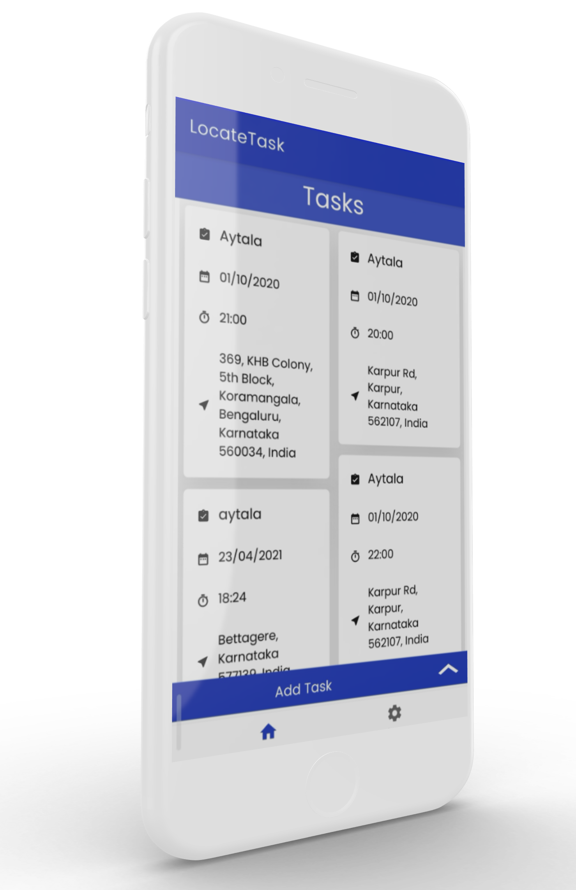
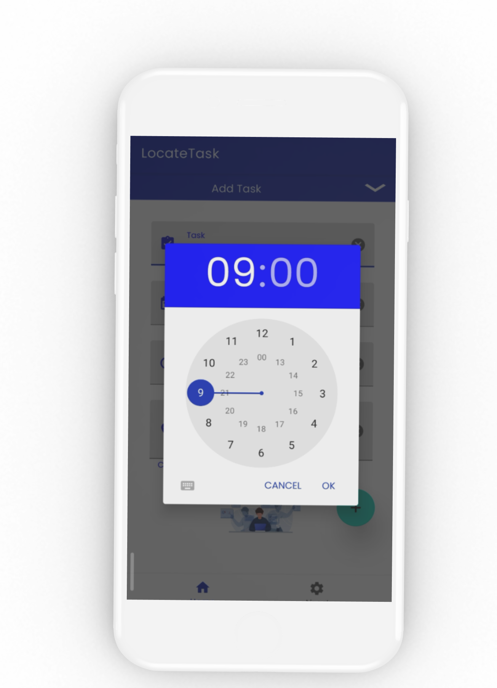
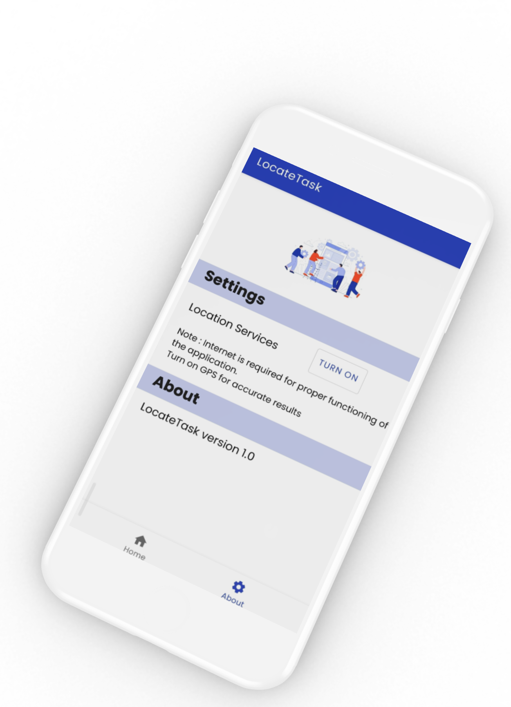

# LocateTask
Android Application for managing tasks on the go.

Uses

> 
> - `Firebase - GeoFire`(an open-source library for Java that allows to store and query a set of keys based on their geographic location)
> - `SQLite`
>

